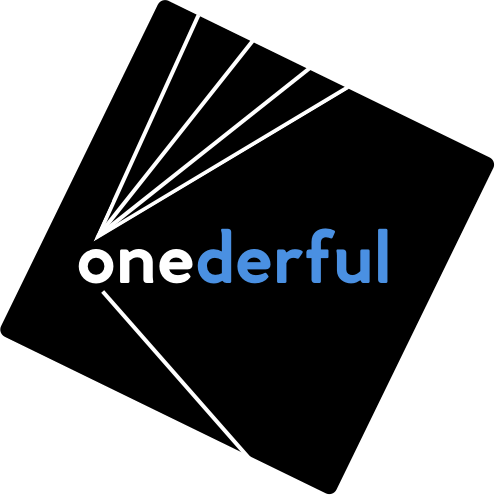
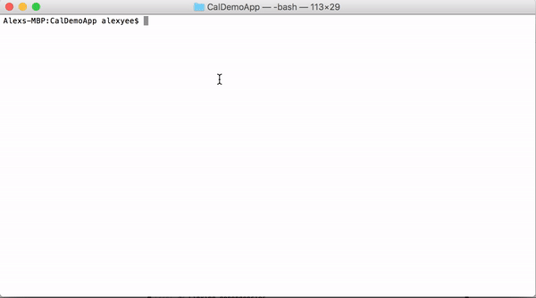

# Onederful Quickstart


<p align="center">
      
    </p>

**Requirements**:
 * Node > v6.0 (to download go to [Node.js](https://nodejs.org/en/download/))
 * [Yarn](https://yarnpkg.com/) (install globally)
 ```shell
$ sudo npm install -g yarn
 ```


### Getting Started
**Step 1**. Clone the repository

```shell
$ git clone -o onederful-quickstart -b master --single-branch \
       https://github.com/alxyee/onederful-quickstart.git NameOfApp

$ cd NameOfApp
```


**Step 2**. Install packages

```shell
$ yarn install                  # Install project dependencies listed in package.json
```


**Step 3**. Compile and launch your app, once completed it will be on:  [http://localhost:3000/](http://localhost:3000/)

```shell
$ yarn start                    # Compiles the app and opens it in a browser with "live reload"
```




Check out the onederful quickstart [Demo](http://onederful-quickstart.s3-website-us-west-2.amazonaws.com/)


### This boilerplate is a modified version of React Static Boilerplate. For more more advanced setup and detailed info on the config go to:
[React Static Boilerplate](https://github.com/kriasoft/react-static-boilerplate)


### Appendix

Check version of node (as of writing mine is v6.3.1)
```shell
$ node -v
```

Check version of Yarn (as of writing mine is v0.22.0):
```shell
$ yarn -v
```
